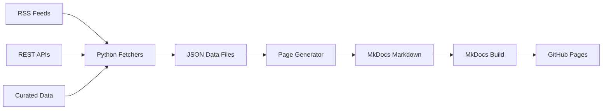

# :material-database: Data Sources & Methodology

**Last updated:** 2026-03-10 14:39 UTC

## How This Dashboard Works

This dashboard is automatically generated by a Python data pipeline that:

1. **Fetches** data from multiple threat intelligence sources via APIs and RSS feeds
2. **Processes** and analyses the raw data to extract key metrics and trends
3. **Generates** MkDocs markdown pages with embedded data and chart configurations
4. **Builds** the static site using MkDocs with the Material theme
5. **Deploys** to GitHub Pages via GitHub Actions

The pipeline runs on a scheduled basis (configurable via GitHub Actions cron) to keep data current.

## Data Sources

### Australian Government

| Source | Type | URL | Update Frequency |
|--------|------|-----|-----------------|
| ASD/ACSC Alerts | RSS Feed | [cyber.gov.au](https://www.cyber.gov.au/) | As published |
| ASD/ACSC Publications | RSS Feed | [cyber.gov.au](https://www.cyber.gov.au/) | As published |
| AusCERT Bulletins | RSS Feed | [auscert.org.au](https://www.auscert.org.au/) | As published |
| OAIC NDB Reports | Curated data | [oaic.gov.au](https://www.oaic.gov.au/) | Bi-annual |

### International Government

| Source | Type | URL | Update Frequency |
|--------|------|-----|-----------------|
| CISA Advisories | RSS Feed | [cisa.gov](https://www.cisa.gov/) | As published |
| CISA KEV Catalog | JSON API | [cisa.gov](https://www.cisa.gov/known-exploited-vulnerabilities-catalog) | As updated |
| NVD (CVE Database) | REST API | [nvd.nist.gov](https://nvd.nist.gov/) | Continuous |

### Community Threat Intelligence

| Source | Type | URL | Update Frequency |
|--------|------|-----|-----------------|
| abuse.ch URLhaus | REST API | [urlhaus.abuse.ch](https://urlhaus.abuse.ch/) | Real-time |
| abuse.ch ThreatFox | REST API | [threatfox.abuse.ch](https://threatfox.abuse.ch/) | Real-time |
| abuse.ch MalwareBazaar | REST API | [bazaar.abuse.ch](https://bazaar.abuse.ch/) | Real-time |
| AlienVault OTX | REST API | [otx.alienvault.com](https://otx.alienvault.com/) | Real-time |

### Strategic & Geopolitical

| Source | Type | URL | Update Frequency |
|--------|------|-----|-----------------|
| ASPI (The Strategist) | RSS Feed | [aspi.org.au](https://www.aspi.org.au/) | As published |
| BleepingComputer | RSS Feed | [bleepingcomputer.com](https://www.bleepingcomputer.com/) | As published |

### Optional (API Key Required)

| Source | Type | URL | Environment Variable |
|--------|------|-----|---------------------|
| NVD | REST API | [nvd.nist.gov](https://nvd.nist.gov/) | `NVD_API_KEY` |
| AlienVault OTX | REST API | [otx.alienvault.com](https://otx.alienvault.com/) | `OTX_API_KEY` |
| GreyNoise | REST API | [greynoise.io](https://www.greynoise.io/) | `GREYNOISE_API_KEY` |
| Shodan | REST API | [shodan.io](https://www.shodan.io/) | `SHODAN_API_KEY` |

## API Key Setup Guide

All API keys are optional. The dashboard will still build without them, but enabling them unlocks richer data. Keys should be stored as **GitHub Secrets** (Settings > Secrets and variables > Actions) for the automated pipeline, or as environment variables for local development.

### NVD (National Vulnerability Database)

The NVD API works without a key, but rate-limits unauthenticated requests to 5 per 30 seconds. With a key, you get 50 per 30 seconds.

1. Go to [https://nvd.nist.gov/developers/request-an-api-key](https://nvd.nist.gov/developers/request-an-api-key)
2. Enter your email address and organisation
3. Check your inbox for the API key (arrives within minutes)
4. **GitHub Secret name:** `NVD_API_KEY`

**Cost:** Free, no usage limits beyond rate throttling.

### AlienVault OTX (Open Threat Exchange)

OTX provides community-sourced threat intelligence pulses, IOCs, and adversary tracking.

1. Go to [https://otx.alienvault.com/](https://otx.alienvault.com/) and create a free account
2. Once logged in, go to **Settings** (click your avatar, top-right)
3. Your API key is displayed under **OTX Key** on the settings page
4. Optionally subscribe to relevant pulses (e.g. search for "Australia", "APT40", "Critical Infrastructure") to get more targeted data
5. **GitHub Secret name:** `OTX_API_KEY`

**Cost:** Free. No usage limits for the public API.

### GreyNoise

GreyNoise classifies internet scanning traffic as benign or malicious. The community tier provides basic IP lookups.

1. Go to [https://viz.greynoise.io/signup](https://viz.greynoise.io/signup) and create a free Community account
2. Once logged in, go to **Account > API Key**
3. Copy the API key
4. **GitHub Secret name:** `GREYNOISE_API_KEY`

**Cost:** Free Community tier (limited queries/day). Paid tiers available for full trend data and bulk lookups.

### Shodan

Shodan indexes internet-facing devices and services globally. Used here to query Australian IP space exposure.

1. Go to [https://account.shodan.io/register](https://account.shodan.io/register) and create an account
2. Once logged in, your API key is shown on the [Account page](https://account.shodan.io/)
3. The free tier provides basic search. A paid membership (one-time USD $49 for lifetime) unlocks filters like `country:AU`
4. **GitHub Secret name:** `SHODAN_API_KEY`

**Cost:** Free tier available. Lifetime membership recommended for country-level queries.

### Adding Secrets to GitHub

In your repository:

1. Go to **Settings > Secrets and variables > Actions**
2. Click **New repository secret**
3. Add each key with the exact name shown above (e.g. `NVD_API_KEY`)
4. The GitHub Actions workflow already references these secrets

## Architecture



## Running Locally

```bash
# Install dependencies
pip install -r requirements.txt

# Set API keys (optional, enhances data)
export SHODAN_API_KEY="your-key"
export NVD_API_KEY="your-key"
export OTX_API_KEY="your-key"
export GREYNOISE_API_KEY="your-key"

# Fetch data and generate pages
python -m scripts.build_all

# Preview locally
mkdocs serve

# Build static site
mkdocs build
```
